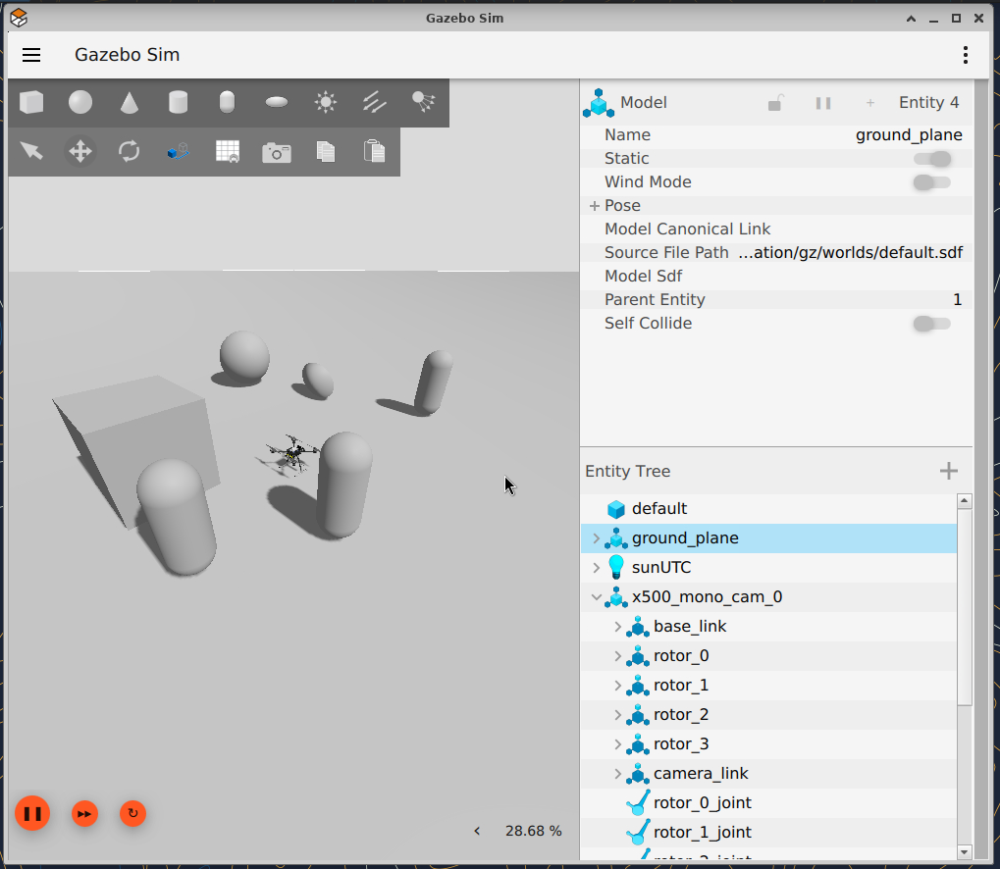
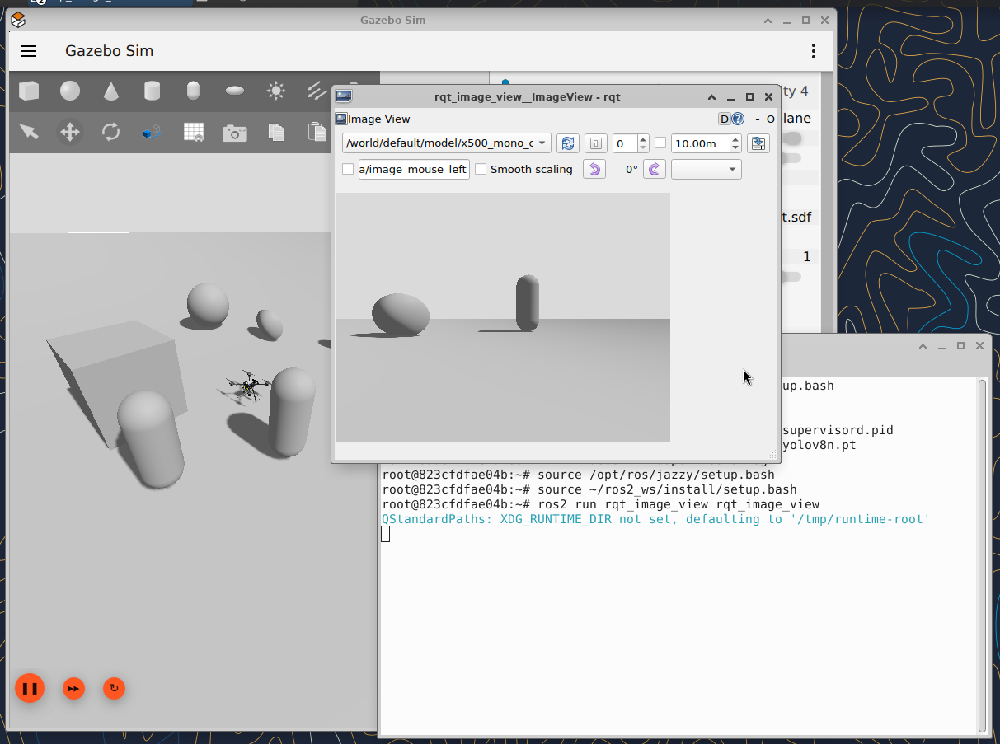
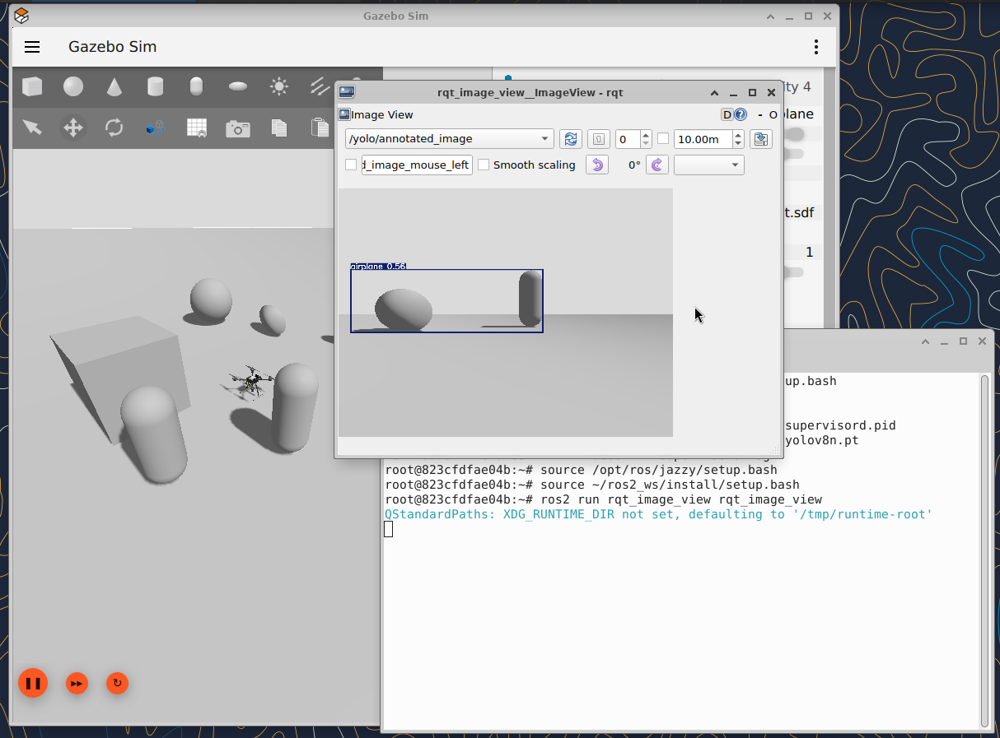

*Note: This will be kept seperately from the original README.md for this time, since it's expected there will be a lot to document based on the first attempt to get the project running*

[GitHub Repository Link](https://github.com/AnoukMartinez/px4-sim)

---

# Setup

For the setup, we can keep close to the original instructions.

Terminal 1
```bash
./build.sh --all # This took quite some time for me
docker-compose build --no-cache
docker-compose up
```
The initial building process might take a while. I additionally needed to build the container again after using the no-cache flag for me. Not doing this caused a large amount of issues, although I am not entirely sure why this was needed it might be good to include it here just in case.

Terminal 2 (PX4)
```bash
docker exec -it px4_sitl bash
cd /root/PX4-Autopilot
make px4_sitl gz_x500
```

Terminal 2 (Topic Bridge)
```bash
ros2 run ros_gz_bridge parameter_bridge \
  /world/default/model/x500_mono_cam_0/link/camera_link/sensor/camera/image@sensor_msgs/msg/Image@gz.msgs.Image # Additionally, I needed to run a bridge to get the camera topics working
```
We can then check the WebUI to see if the robot shows up properly. For now, this is all we need for the initial setup. Further steps down below.
---

# Task Documentation

## 1. Object Detection with YOLO
### a) Create a 3D environment with objects
At first, I attempted to import one of the models from Fuel. This worked fine, however I ran into several unrelated problems and ultimately decided to reset the progress and start over.

After this, I decided to just run the default environment and place some objects manually. For now, I used a few abstract cubes and shapes, but later when the project works this could still be modified.

### b) Start PX4 SITL with a vehicle equipped with a monocular camera
For now, I started the default vehicle (`make px4_sitl gz_x500`).

### c) Implement a ROS2 node that subscribes to camera images and publishes object detections
I suppose at this point I realized that the default model does not have a camera, so I reran with `make px4_sitl gz_x500_mono_cam`. Still, the camera wasn't part of the topics. This is where the bridge came into play, which is a command I now included in the setup above already.

I continued by creating the `ros2_ws` on the root folder manually. Running the steps to create the nodes for the yolo detector and the messages was straightforward and quite similar to the implementations from last week. I used the command `ros2 pkg create yolo_detector --build-type ament_python --dependencies rclpy sensor_msgs cv_bridge` for this.

Attempting to then run the node, however, resulted in docker crashing for the first time.
```
running wslexec: An error occurred while running the command. DockerDesktop/Wsl/ExecError: c:\windows\system32\wsl.exe --unmount docker_data.vhdx: exit status 0xffffffff (stderr: , wslErrorCode: DockerDesktop/Wsl/ExecError)
```

Rebooting docker resulted in a different error.
```
running wsl distro proxy in Ubuntu distro: running proxy: docker-desktop-user-distro proxy has not started after 4 minutes, killing it
```

Rerunning docker-compose shows no results.
```
request returned 500 Internal Server Error for API route and version http://%2F%2F.%2Fpipe%2FdockerDesktopLinuxEngine/v1.51/containers/json?all=1&filters=%7B%22label%22%3A%7B%22com.docker.compose.config-hash%22%3Atrue%2C%22com.docker.compose.oneoff%3DFalse%22%3Atrue%2C%22com.docker.compose.project%3Dpx4-sim%22%3Atrue%7D%7D, check if the server supports the requested API version
```

At this point I just restarted everything. I started up all the services as instructed and in order as instructed in the readme once again. Inspecting the topic list now reveals the expected camera connection, revealing the following information being publishes actively as well.
```
root@823cfdfae04b:~# ros2 topic list | grep image
/world/default/model/x500_mono_cam_0/link/camera_link/sensor/camera/image

root@823cfdfae04b:~# ros2 topic hz /world/default/model/x500_mono_cam_0/link/camera_link/sensor/camera/image
average rate: 4.450
        min: 0.105s max: 0.352s std dev: 0.08552s window: 5
average rate: 4.486
        min: 0.059s max: 0.352s std dev: 0.10447s window: 10
average rate: 6.086
        min: 0.057s max: 0.352s std dev: 0.10550s window: 21
```

I also realized my yolo_node.py was located in the wrong folder, most likely what caused the issues before, and moved it to the yolo_detector subfolder inside the package.
After implementing some very simple code to check if the nodes work for now for both the yolo detector and messages, running the nodes resulted in some issues regarding python packages.

```
ImportError: 
A module that was compiled using NumPy 1.x cannot be run in
NumPy 2.4.4 as it may crash. To support both 1.x and 2.x
versions of NumPy, modules must be compiled with NumPy 2.0.
Some module may need to rebuild instead e.g. with 'pybind11>=2.12'.

If you are a user of the module, the easiest solution will be to
downgrade to 'numpy<2' or try to upgrade the affected module.
We expect that some modules will need time to support NumPy 2.
```

I attempted to fix this by downgrading numpy, however this also resulted in more issues.

```
root@823cfdfae04b:~/ros2_ws# ros2 run yolo_detector yolo_node
AttributeError: module 'numpy._globals' has no attribute '_signature_descriptor'
ImportError: cannot load module more than once per process
Traceback (most recent call last):
...
ImportError: numpy._core.multiarray failed to import
[ros2run]: Process exited with failure 1
```

I continued the next day, starting with a different approach. Since there were a lot of issues related to the packages, I decided to run the code from inside a custom environment I called `ros2_venv`.
I then ran these steps in order.

```bash
# Terminal 1: PX4
docker exec -it px4_sitl bash
source ~/ros2_venv/bin/activate
source /opt/ros/jazzy/setup.bash
cd ~/PX4-Autopilot
make px4_sitl gz_x500_mono_cam

# Terminal 2: Bridge
docker exec -it px4_sitl bash
source ~/ros2_venv/bin/activate
source /opt/ros/jazzy/setup.bash
ros2 run ros_gz_bridge parameter_bridge /world/default/model/x500_mono_cam_0/link/camera_link/sensor/camera/image@sensor_msgs/msg/Image[gz.msgs.Image

# Terminal 3: MAVROS
docker exec -it px4_sitl bash
source ~/ros2_venv/bin/activate
source /opt/ros/jazzy/setup.bash
ros2 run mavros mavros_node --ros-args -p fcu_url:=udp://:14540@14557

# Terminal 4: The YOLO implementations
docker exec -it px4_sitl bash
source ~/ros2_venv/bin/activate
source /opt/ros/jazzy/setup.bash
cd ~/ros2_ws
source install/setup.bash
ros2 run yolo_detector yolo_node
```

Running the YOLO nodes resulted in the following console output.
```
(ros2_venv) root@823cfdfae04b:~/ros2_ws# ros2 run yolo_detector yolo_node

```
The space after the command indicating that *something* is actively running, I assumed. Checking for the packages however revealed that nothing including 'yolo' in the name was active (Via `(ros2_venv) root@823cfdfae04b:~# ros2 pkg list | grep yolo`). I therefore quit the terminal running the yolo_node and built it once again.

The building process failed several times.
```bash
(ros2_venv) root@823cfdfae04b:~/ros2_ws# colcon build --packages-select yolo_detector
Starting >>> yolo_detector
--- stderr: yolo_detector                   
usage: setup.py [global_opts] cmd1 [cmd1_opts] [cmd2 [cmd2_opts] ...]
   or: setup.py --help [cmd1 cmd2 ...]
   or: setup.py --help-commands
   or: setup.py cmd --help

error: option --uninstall not recognized
---
Failed   <<< yolo_detector [1.83s, exited with code 1]

Summary: 0 packages finished [2.13s]
  1 package failed: yolo_detector
  1 package had stderr output: yolo_detector
```

I ran this command `(ros2_venv) root@823cfdfae04b:~/ros2_ws# rm -rf build/yolo_detector install/yolo_detector log/`, reran the building process, and now everything seems to be working.

```bash
(ros2_venv) root@823cfdfae04b:~/ros2_ws# colcon build --packages-select yolo_detector
[0.287s] WARNING:colcon.colcon_ros.prefix_path.ament:The path '/root/ros2_ws/install/yolo_detector' in the environment variable AMENT_PREFIX_PATH doesn't exist
Starting >>> yolo_detector
--- stderr: yolo_detector                   
/usr/lib/python3/dist-packages/pbr/git.py:28: UserWarning: pkg_resources is deprecated as an API. See https://setuptools.pypa.io/en/latest/pkg_resources.html. The pkg_resources package is slated for removal as early as 2025-11-30. Refrain from using this package or pin to Setuptools<81.
  import pkg_resources
---
Finished <<< yolo_detector [2.16s]

Summary: 1 package finished [2.38s]
  1 package had stderr output: yolo_detector
```
```
(ros2_venv) root@823cfdfae04b:~/ros2_ws# ros2 pkg list | grep yolo
yolo_detector
yolo_msgs
(ros2_venv) root@823cfdfae04b:~/ros2_ws# ros2 run yolo_detector yolo_node
[INFO] [1776437635.116691749] [yolo_node]: Loading YOLO model
[INFO] [1776437635.529965664] [yolo_node]: Node started
```

### d) Detect objects from camera stream & e) Define a custom ROS2 message for detection result

Checking the actual topic itself, we can see an example of an object detection in the world as well.

```bash
docker exec -it px4_sitl bash
source ~/ros2_venv/bin/activate
source /opt/ros/jazzy/setup.bash
source ~/ros2_ws/install/setup.bash
ros2 topic echo /yolo/detections

header:
  stamp:
    sec: 317
    nanosec: 528000000
  frame_id: camera_link
detections:
- header:
    stamp:
      sec: 317
      nanosec: 528000000
    frame_id: camera_link
  class_name: airplane # <- The prediction, I presume
  confidence: 0.5554531812667847
  x: 414.59173583984375
  y: 431.0927734375
  width: 735.4232177734375
  height: 240.68310546875
---
```
For now, as described earlier, we only have a simple world with some basic shapes. I presume the object detection doesn't work exactly as intended because of this. I decided to modify the world properly only once all the technical issues are resolved.


Additionally, I also [modified](https://wiki.ros.org/cv_bridge/Tutorials/ConvertingBetweenROSImagesAndOpenCVImagesPython) the `yolo_node.py` again to include teh annotated image version.
```
annotated = result.plot()
annotated_msg = self.bridge.cv2_to_imgmsg(annotated, 'bgr8')
annotated_msg.header = msg.header
self.img_pub.publish(annotated_msg)
```

### f) Visualize detections overlaid on the image stream
To have a look at the image stream, I ran this in the WebUI (VNC).
```
source /opt/ros/jazzy/setup.bash
source ~/ros2_ws/install/setup.bash
ros2 run rqt_image_view rqt_image_view
```
The normal camera feed looks like this.


While the annotated camera feed (available in the dropdown) looks like this.


### g) Measure inference latency and throughput (FPS)
For the last part, I inspected the info returned by the node process by the callback function. I let the node run for some time and documented the outputs. The full output can be found [here](./latency_log.txt).

I implemented these code fragments to print some info about the current state in a set time interval to make it easy to inspect.

```py
  ...
  self.frame_count = 0
  self.total_latency = 0.0
  self.fps_start_time = time.time()

  def callback(self, msg):
  ...
    if self.frame_count % 10 == 0:
      avg_latency = self.total_latency / self.frame_count
      self.get_logger().info(f'FPS: {fps:.1f} | Latency: {latency:.1f}ms | Avg: {avg_latency:.1f}ms | Frames: {self.frame_count}')
```

```bash
[INFO] [1776437643.735660157] [yolo_node]: FPS: 1.2 | Latency: 531.2ms | Avg: 758.3ms | Frames: 10
[INFO] [1776437650.731295144] [yolo_node]: FPS: 1.3 | Latency: 737.9ms | Avg: 722.2ms | Frames: 20
[INFO] [1776437657.153561789] [yolo_node]: FPS: 1.4 | Latency: 476.9ms | Avg: 682.0ms | Frames: 30
...
[INFO] [1776440903.931020198] [yolo_node]: FPS: 1.6 | Latency: 390.0ms | Avg: 526.1ms | Frames: 5280
[INFO] [1776440910.607591485] [yolo_node]: FPS: 1.6 | Latency: 292.0ms | Avg: 526.2ms | Frames: 5290
[INFO] [1776440915.802787418] [yolo_node]: FPS: 1.6 | Latency: 333.1ms | Avg: 526.0ms | Frames: 5300
```